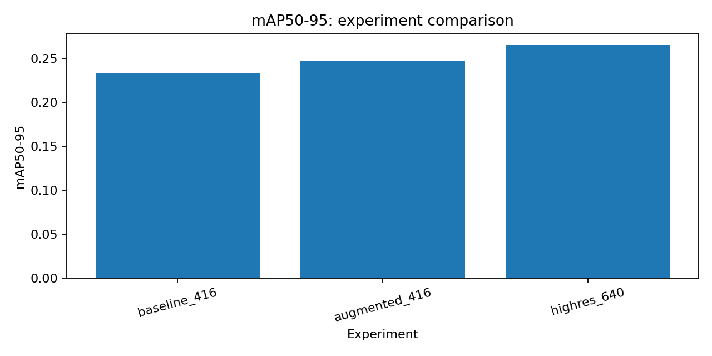
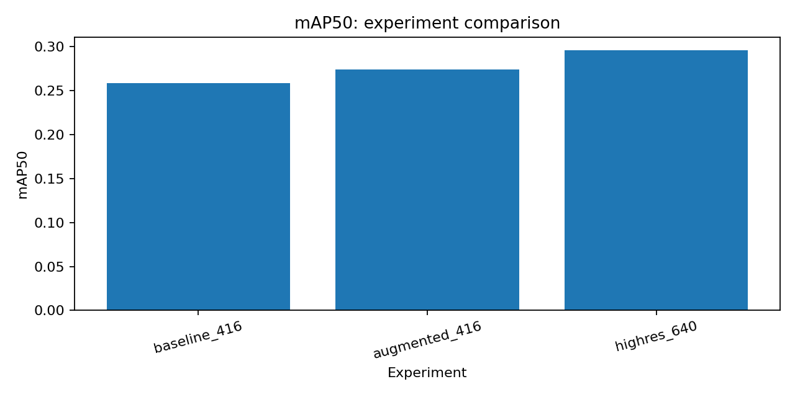
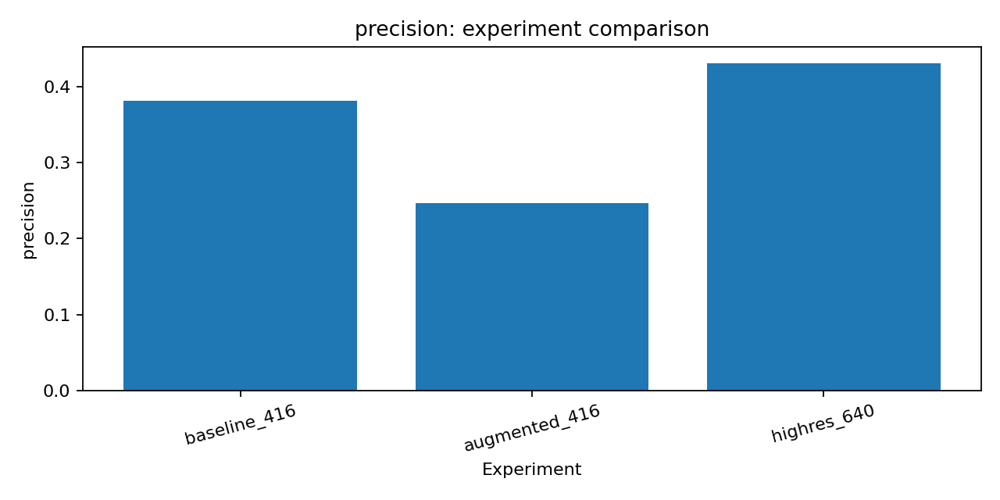
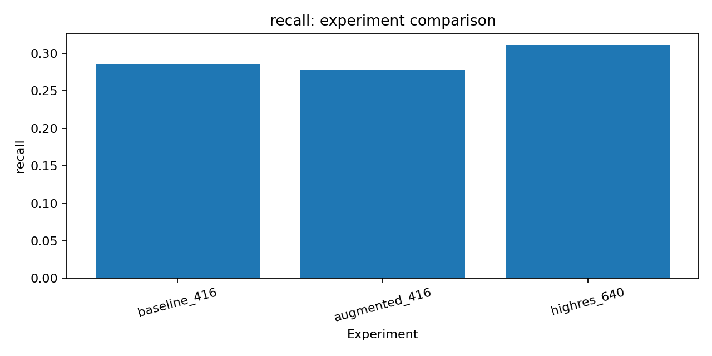
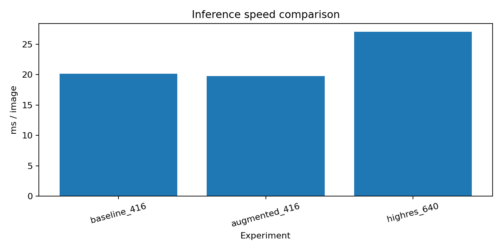
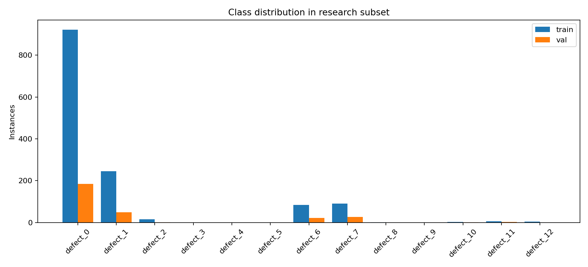

# Welding Defect Segmentation — Research Project

Research-oriented computer vision project for **welding defect segmentation on radiographic images** using **YOLOv8n-seg**.

The goal is not only to train a segmentation model, but to run controlled experiments and analyze how **data augmentation** and **input resolution** affect model quality and inference speed.

## Research Question

> How do stronger data augmentation and increased input resolution affect YOLOv8n-seg performance for welding-defect segmentation?

## Dataset

Radiographic welding defect dataset:

`viacheslavasadchiy/radiographs-welding-defect-detection`

Full dataset:

- 21,436 training images
- 5,360 validation images
- 13 defect classes

For Colab-friendly controlled experiments, I used a fixed reproducible subset:

- 796 training images
- 198 validation images
- random seed: `42`

The same subset was used for every experiment.

## Experimental Setup

Model: **YOLOv8n-seg**

All experiments use:

- pretrained YOLOv8n-seg weights
- AdamW optimizer
- learning rate `1e-3`
- 10 epochs
- fixed random seed `42`
- identical train/validation split
- offline evaluation

Three configurations were compared:

| Experiment | Resolution | Description |
|---|---:|---|
| baseline_416 | 416 | Baseline augmentation |
| augmented_416 | 416 | Stronger augmentation |
| highres_640 | 640 | Higher input resolution |

## Results

| Experiment | Precision | Recall | mAP50 | mAP50-95 | Inference |
|---|---:|---:|---:|---:|---:|
| baseline_416 | 0.3815 | 0.2857 | 0.2586 | 0.2334 | 20.18 ms |
| augmented_416 | 0.2469 | 0.2773 | 0.2739 | 0.2479 | 19.74 ms |
| **highres_640** | **0.4306** | **0.3112** | **0.2963** | **0.2655** | 27.08 ms |

### mAP50-95



### mAP50



### Precision



### Recall



### Inference Speed



## Key Findings

The best configuration was **highres_640**.

It achieved:

- **mAP50-95: 0.2655**
- **mAP50: 0.2963**
- **Precision: 0.4306**
- **Recall: 0.3112**

Increasing input resolution from 416 to 640 improved mAP50-95 from:

`0.2334 → 0.2655`

This corresponds to approximately **13.8% relative improvement** over the baseline.

However, inference became slower:

`20.18 ms/image → 27.08 ms/image`

This demonstrates a clear **quality vs. inference-cost trade-off**.

Stronger augmentation also improved mAP50-95:

`0.2334 → 0.2479`

or approximately **6.2% relative improvement** over baseline.

## Class Distribution



The reduced validation subset is strongly class-imbalanced.

This is important because several rare classes contain only a small number of examples, making their metrics unstable.

## Failure Analysis

Per-class evaluation showed a large difference between common and rare defect classes.

For the high-resolution model:

- `defect_6` mask mAP50 ≈ **0.948**
- `defect_7` mask mAP50 ≈ **0.951**

At the same time, several rare classes have near-zero performance.

This suggests that **class imbalance and insufficient rare-class coverage are major limitations** of the current experimental setup.

## Example Predictions

Qualitative predictions from the best experiment are available in:

[`results/example_predictions`](results/example_predictions)

These examples are used to visually inspect segmentation quality and failure cases.

## Limitations

- Reduced dataset subset was used for Colab-friendly experiments.
- Strong class imbalance exists in the validation subset.
- Only one random seed was evaluated.
- Training was limited to 10 epochs.
- Only one model family was tested.
- Rare-class metrics are not statistically robust.

## Next Research Steps

1. Implement class-aware sampling.
2. Run experiments with multiple random seeds and report mean/std.
3. Perform detailed per-class AP analysis.
4. Analyze false positives and false negatives.
5. Compare another segmentation architecture.
6. Reproduce and adapt a method from a relevant scientific paper.

## Repository Structure

```text
weld-defect-ds-research/
├── README.md
├── requirements.txt
├── src/
│   └── Weld_Defect_DS_Research_FINAL.py
├── docs/
│   └── research_summary.txt
└── results/
    ├── experiment_results.csv
    ├── class_distribution.csv
    ├── class_distribution.png
    ├── mAP50-95_comparison.png
    ├── mAP50_comparison.png
    ├── precision_comparison.png
    ├── recall_comparison.png
    ├── inference_speed_comparison.png
    └── example_predictions/
```

## Reproduction

The experiments were run in **Google Colab with an NVIDIA Tesla T4 GPU**.

Install dependencies:

```bash
pip install ultralytics kagglehub opencv-python pyyaml pandas matplotlib tabulate
```

Run:

```bash
python src/Weld_Defect_DS_Research_FINAL.py
```

The script downloads the dataset, prepares the experimental subset, trains all three configurations, evaluates them and generates the result artifacts.

## Tech Stack

**Python · PyTorch · YOLOv8 · OpenCV · Pandas · NumPy · Matplotlib · CUDA · Google Colab**

## Author

**Serafima Saltanova**

GitHub: @S1materp